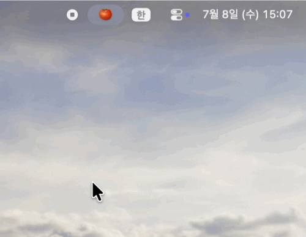
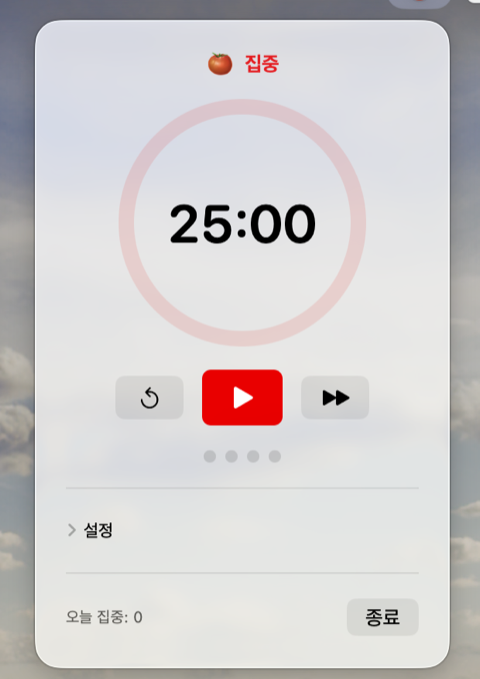

# Jansori Tomato 🍅👀

[English](README.md) · **한국어**

잔소리하는 macOS 메뉴바 뽀모도로 타이머. 집중하는 동안 눈 한 쌍(👀)이 메뉴바에서 쑥 튀어나와 커서를 좇으며 "딴짓하지 말라"고 **잔소리**합니다. 시간이 끝나면 잔잔한 전체화면 휴식이 작업을 멈춰 주고, 준비되면 다시 집중하도록 불러옵니다.

<p align="center">
  
</p>

> 상태: 초기 릴리즈 (v0.1.1).

## 기능

- **메뉴바 타이머** — 집중 / 짧은 휴식 / 긴 휴식, 남은 시간 메뉴바 표시.
- **감시하는 눈 👀** — 집중 중 눈 한 쌍이 **무작위 간격**으로 메뉴바에서 튀어나와 커서를 좇으며 잔소리를 던집니다("딴짓하지 말랬지? 👀"). 클릭이 통과돼 작업을 방해하지 않습니다.
- **전체화면 휴식 (Flow 앱 방식)** — 집중이 끝나면 프로스트 블러 휴식 화면이 떠서 진짜로 쉬게 합니다. 언제든 닫을 수 있고, 휴식이 끝나면 "집중 다시 시작" 프롬프트가 알아서 팝업됩니다.
- **네이티브 알림** — 세션 전환 시 알림, 완료 사운드(옵션).
- **한/영 지원** — 앱 안에서 즉시 전환.
- **로그인 시 자동 시작**, Dock 아이콘 없이 메뉴바에만 상주.

## 스크린샷



메뉴바 토마토를 누르면 타이머가 열립니다. 집중이 끝나면 전체화면 휴식이 작업을 멈춰 줍니다:


## 설치

**macOS 13 (Ventura) 이상** 필요.

### Homebrew (권장)

```bash
brew install --cask han-hyeonmin/tap/jansori-tomato
```

### 직접 다운로드

[Releases](https://github.com/han-hyeonmin/jansori-tomato/releases)에서 최신 `JansoriTomato-x.y.z.zip`을 받아 압축을 풀고 **Jansori Tomato.app**을 `/Applications`로 드래그합니다.

> **첫 실행:** 아직 코드 서명이 안 돼 있어 Gatekeeper가 막습니다. 앱을 **우클릭 → 열기 → 열기** 하면 됩니다(최초 1회). Homebrew로 설치해도 동일합니다.

### 소스에서 빌드

Swift Package라 전체 Xcode 없이 Command Line Tools만으로 빌드됩니다.

```bash
swift run                       # 개발 중 바로 실행

Scripts/make-icon.sh            # 앱 아이콘 생성 (최초 1회)
Scripts/bundle-app.sh release   # → build/Jansori Tomato.app
open "build/Jansori Tomato.app"
```

Xcode가 있다면 `open Package.swift` 로 열어 그대로 개발할 수 있습니다.

## 프로젝트 구조

```
Sources/PomodoroTimer/
  PomodoroTimerApp.swift        # @main, MenuBarExtra 진입점
  TimerEngine.swift             # 타이머 상태 머신 (ObservableObject)
  Models/                       # SessionType, PomodoroSettings
  Views/ControlPanelView.swift  # 메뉴바 팝오버
  CheckIn/                      # 감시하는 눈 캐릭터 (peek·커서 추적·말풍선)
  Break/                        # 전체화면 휴식 오버레이 (Flow 방식)
  Support/                      # 알림, 로그인 시 자동 시작, 다국어
Scripts/
  bundle-app.sh                 # 실행 파일 → .app 번들
  package-release.sh            # 릴리즈용 빌드 + zip + sha256
  IconGenerator.swift + make-icon.sh   # 코드로 그린 H-토마토 앱 아이콘
```

개발 팁: `CHECKIN_PREVIEW=1 swift run` → 캐릭터 즉시 등장, `BREAK_PREVIEW=1 swift run` → 휴식→재개 오버레이 표시.

## 로드맵

- [x] 타이머 코어 + 메뉴바 UI
- [x] 감시하는 눈 체크인 캐릭터 (메뉴바 peek, 커서 추적, 말풍선, 무작위 타이밍)
- [x] 전체화면 휴식 오버레이 (자동 시작 + 재개 프롬프트)
- [x] 네이티브 알림 + 사운드, 로그인 시 자동 시작, 다국어, 앱 아이콘
- [x] GitHub 릴리즈 + Homebrew tap (v0.1.1)
- [ ] `homebrew/cask` 본진 제출
- [ ] 코드 서명 / 공증

## 라이선스

MIT
