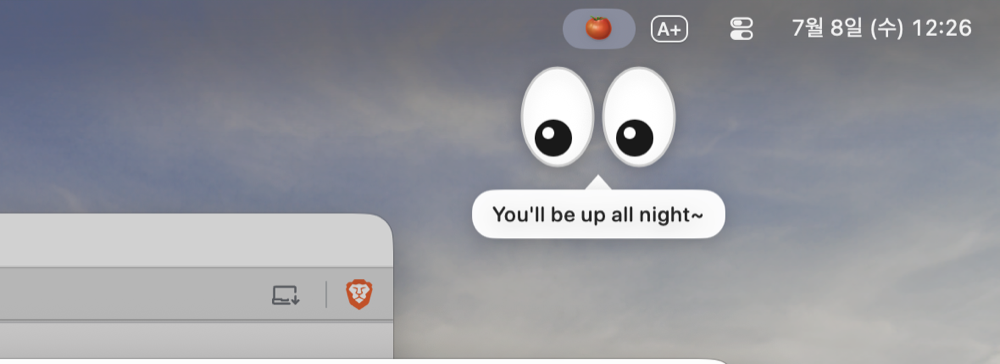

# Jansori Tomato 🍅👀

**English** · [한국어](README.ko.md)

A macOS menu bar Pomodoro timer with a twist: a cute pair of eyes peeks out from your menu bar during focus sessions to *nag* you about staying on task. ("Jansori" / 잔소리 is Korean for nagging.) When it's time to rest, a calm full-screen break takes over — and nudges you back when you're ready.

<p align="center">
  
</p>

> Status: early release (v0.1.1).

## Features

- **Menu bar timer** — focus / short break / long break, live countdown in the menu bar.
- **Watching eyes 👀** — during focus, an eyes-only character peeks down from the menu bar at random intervals, tracks your cursor, and speaks a rotating check-in line ("Still focused? 👀"). Click-through and non-intrusive.
- **Full-screen breaks (Flow-style)** — when focus ends, a frosted break screen takes over so you actually rest. Close it anytime; when the break ends, a "resume focus" prompt pops up on its own.
- **Native notifications** on session changes, with an optional completion sound.
- **Bilingual** — English / Korean, switchable in-app.
- **Launch at login**, no Dock icon (menu bar only).

## Screenshots


Click the menu bar tomato for the timer. When a focus session ends, a full-screen break takes over:


## Requirements

- macOS 13 (Ventura) or later
- Swift toolchain (Command Line Tools or full Xcode)

## Install

### Download

Grab the latest `JansoriTomato-x.y.z.zip` from [Releases](https://github.com/han-hyeonmin/jansori-tomato/releases), unzip, and move **Jansori Tomato.app** to `/Applications`.

> The app is currently **unsigned**, so on first launch macOS Gatekeeper will warn you. Right-click the app → **Open** → **Open** to allow it (only needed once).

### Homebrew (coming soon)

```bash
# Planned — via a personal tap
brew install --cask han-hyeonmin/tap/jansori-tomato
```

### Build from source

The project is a Swift Package, so it builds with just Command Line Tools — no full Xcode required.

```bash
swift run                       # run directly during development

Scripts/make-icon.sh            # generate the app icon (once)
Scripts/bundle-app.sh release   # → build/Jansori Tomato.app
open "build/Jansori Tomato.app"
```

Have Xcode installed? Just `open Package.swift` to develop in Xcode.

## Project layout

```
Sources/PomodoroTimer/
  PomodoroTimerApp.swift        # @main, MenuBarExtra entry point
  TimerEngine.swift             # timer state machine (ObservableObject)
  Models/                       # SessionType, PomodoroSettings
  Views/ControlPanelView.swift  # menu bar popover
  CheckIn/                      # watching-eyes character (peek, gaze, speech bubble)
  Break/                        # full-screen break overlay (Flow-style)
  Support/                      # notifications, launch-at-login, localization
Scripts/
  bundle-app.sh                 # executable → .app bundle
  package-release.sh            # build + zip + sha256 for a release
  IconGenerator.swift + make-icon.sh   # code-drawn H-tomato app icon
```

Dev tips: `CHECKIN_PREVIEW=1 swift run` shows the character immediately; `BREAK_PREVIEW=1 swift run` shows the break → resume overlay.

## Roadmap

- [x] Timer core + menu bar UI
- [x] Watching-eyes check-in character (menu bar peek, cursor tracking, speech bubble, randomized timing)
- [x] Full-screen break overlay (auto-start + resume prompt)
- [x] Native notifications + sound, launch at login, bilingual, app icon
- [x] GitHub release + Homebrew tap (v0.1.1)
- [ ] Submit to `homebrew/cask`
- [ ] Code signing / notarization

## License

MIT
